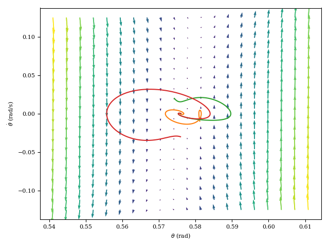
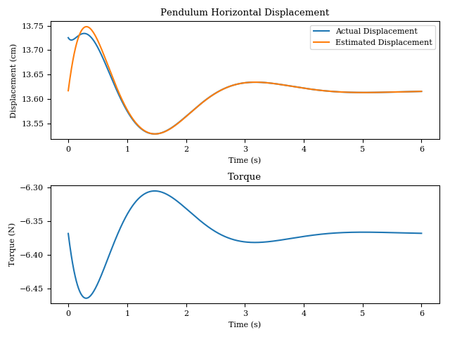

# Inverted Pendulum Control

## Overview

This program implements a nonlinear model and controller for the inverted pendulum. The controller seeks maintain a particular equilibrium (33 degrees was chosen arbitrarily) by computing the torque needed to restore the pendulum to that point. To mimick reality, the controller may not access the pendulum's state, and so the state is estimated using a linearized model.

## Results

### Phase Portrait

The following plot shows the trajectories of the controlled inverted pendulum for a variety of starting conditions. In each case, the controller was initialized with its estimator at the equilibrium.

### Time Response

The response of the pendulum is shown below in comparison to the controller's estimated state and the torque applied by the controller.

